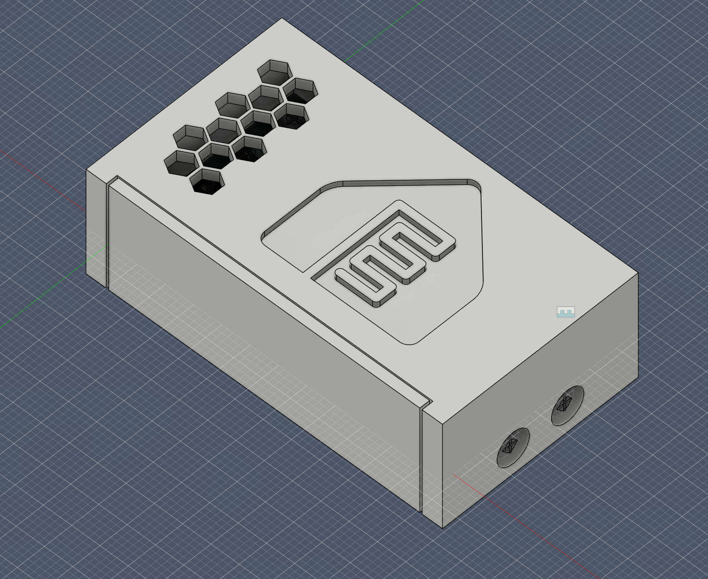
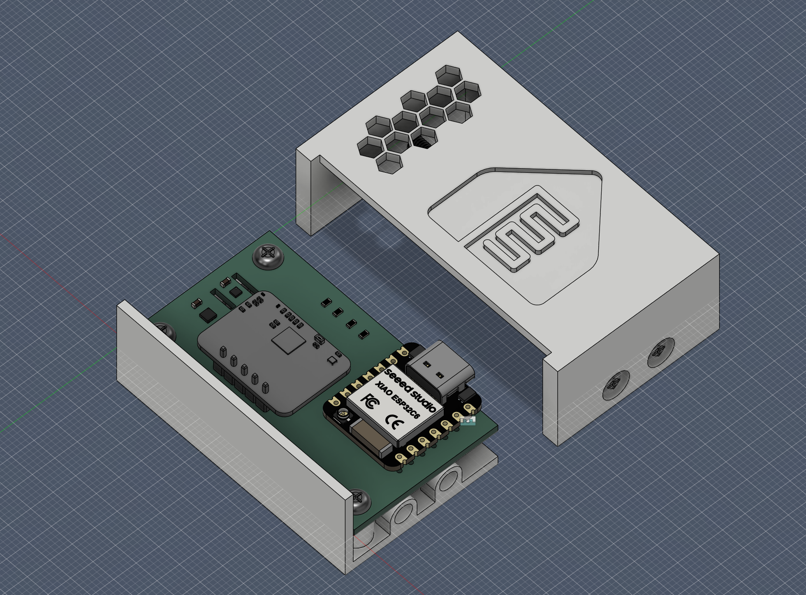
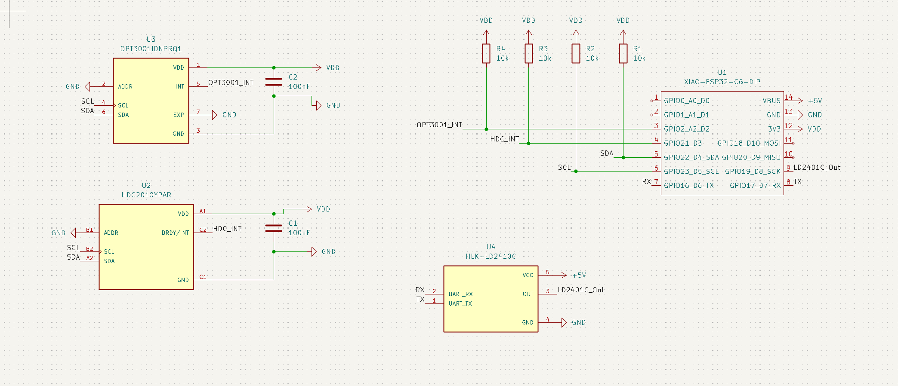
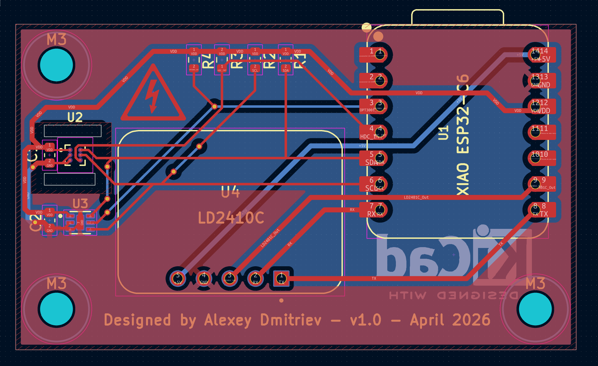

# HA-Sensor-Node

## Overview

### Description
This is a compact sensor node featuring useful sensors to integrate with Home Assistant

### Why I made this project
I made this project because I wanted to try and make a integrated PCB with multiple sensors, and use the bare I2C modules. A Home Assistant sensor node is something that would benefit from being compact, using a custom PCB, and is also something I would use in my life for more advanced automations.

## Features
- Custom PCB for compact wiring
- Temperature/Humidity Sensor (HDC2010)
- Light Sensor (OPT3001)
- Compact size (63mm x 36mm x 20 mm)

### CAD Pictures

## PCB

Drop in the ESP32 and LD2410C sensor into the PCB and solder the connection.

## BOM

See the material list here: [BOM](./HA-Sensor-Node.csv)